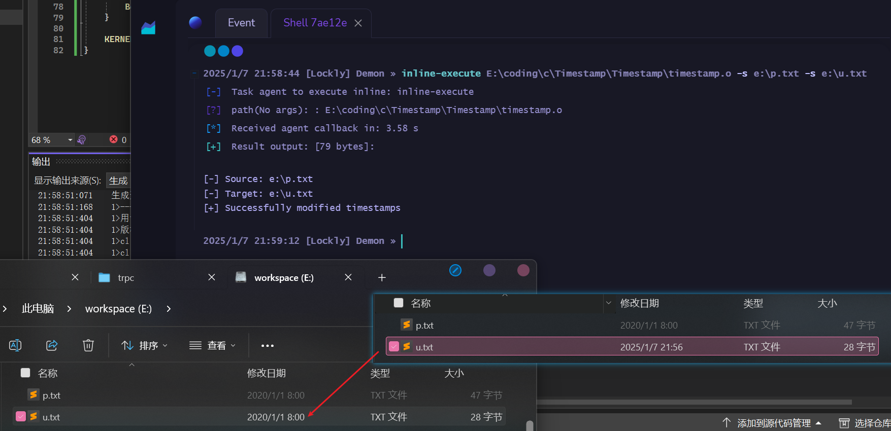

# BOF-Timestamp
A BOF (Beacon Object File) tool for modifying Windows file timestamps.

[中文说明](#中文说明) | [English](#english)

## 中文说明

### 简介
BOF-Timestamp 是一个用于修改Windows文件时间戳的BOF工具。它可以将目标文件的创建时间、访问时间和修改时间同步为源文件的时间戳，主要用于文件伪装和时间戳管理。

### 编译方法
```bash
# 64位版本
x86_64-w64-mingw32-gcc-8.1.0.exe -c .\Source.c -o timestamp.x64.o -Os -fno-asynchronous-unwind-tables -fno-ident -fpack-struct=8 -falign-functions=1 -s -ffunction-sections -fdata-sections -fno-exceptions -fno-stack-protector -mno-stack-arg-probe

# 32位版本
i686-w64-mingw32-gcc-8.1.0.exe -c .\Source.c -o timestamp.x86.o -Os -fno-asynchronous-unwind-tables -fno-ident -fpack-struct=8 -falign-functions=1 -s -ffunction-sections -fdata-sections -fno-exceptions -fno-stack-protector -mno-stack-arg-probe
```

### 使用方法
```bash
beacon> inline-execute timestamp.o "source_file" "target_file"
```

### 输出示例


## English

### Introduction
BOF-Timestamp is a BOF tool for modifying Windows file timestamps. It can synchronize the creation time, access time, and modification time of a target file with the timestamps from a source file, primarily used for file disguise and timestamp management.

### Compilation
```bash
# For 64-bit
x86_64-w64-mingw32-gcc-8.1.0.exe -c .\Source.c -o timestamp.x64.o -Os -fno-asynchronous-unwind-tables -fno-ident -fpack-struct=8 -falign-functions=1 -s -ffunction-sections -fdata-sections -fno-exceptions -fno-stack-protector -mno-stack-arg-probe

# For 32-bit
i686-w64-mingw32-gcc-8.1.0.exe -c .\Source.c -o timestamp.x86.o -Os -fno-asynchronous-unwind-tables -fno-ident -fpack-struct=8 -falign-functions=1 -s -ffunction-sections -fdata-sections -fno-exceptions -fno-stack-protector -mno-stack-arg-probe
```

### Usage
```bash
beacon> inline-execute timestamp.o "source_file" "target_file"
```

### Output Example


## License
This project is licensed under the MIT License - see the [LICENSE](LICENSE) file for details.
